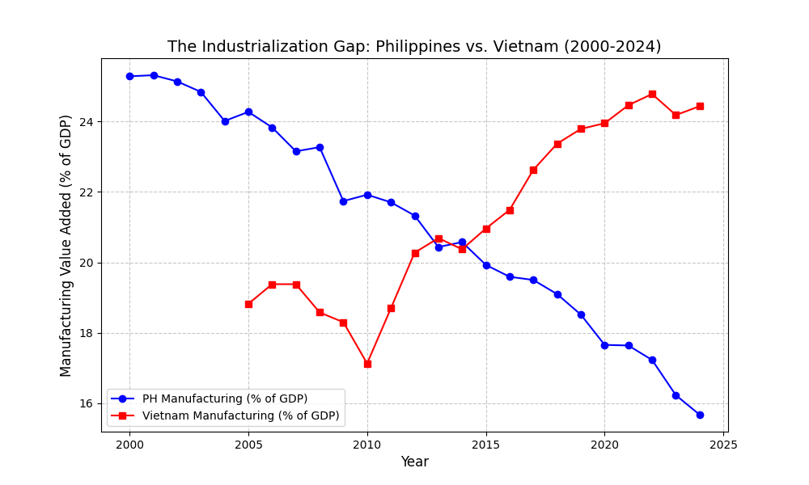

# Philippine_Vietnam_25_year_Poverty_Analysis
Exploring the 25 years Effect of Manufacturing and Services for Poverty Reduction for PH and VN 
# The Service-Led Staircase: Structural Transformation in PH vs. VN
### A Comparative Regression Analysis of Poverty Reduction Efficiency

## 📌 Executive Summary
This project investigates the "Premature Deindustrialization" of the Philippines. While many claim that skipping the industrialization stage has hindered the Philippines compared to Vietnam, this data-driven analysis using **Multiple Linear Regression** suggests that the Philippines has successfully developed a "Service-Led" model for poverty reduction that is statistically more efficient than its stagnant manufacturing sector.

## 🛠️ Tools & Data
- **Language:** Python 3.x
- **Libraries:** `wbgapi` (World Bank API), `pandas`, `statsmodels`, `matplotlib`
- **Data Source:** World Bank Open Data (2000–2025)
- **Methodology:** Ordinary Least Squares (OLS) Regression with Linear Interpolation for missing poverty data.

## 📊 Key Findings
I ran two separate OLS models to compare the "Engines of Growth":

| Variable | Philippines (PHL) | Vietnam (VNM) |
| :--- | :--- | :--- |
| **Manufacturing Coef** | -0.19 (Not Significant) | **-2.23 (Highly Significant)** |
| **Services Coef** | **-1.29 (Highly Significant)** | -0.82 (Significant) |
| **P-value (Mfg)** | 0.740 | 0.000 |
| **R-Squared** | 0.892 | 0.972 |

### The "Ick" vs. The Insight
- **Vietnam** follows the classic "Tiger" model where factories are the primary tool for lifting people out of poverty.
- **The Philippines** has "leapfrogged" into a service-driven economy. While Manufacturing has a negligible impact on poverty (P-value 0.740), the **Services sector is 57% more efficient** at reducing poverty in the PH than it is in Vietnam.

## 📈 Visualizations

*The graph shows Vietnam's manufacturing as a % of GDP pulling away while the Philippines remains flat, confirming the "skipped step" in industrialization.*

## 🚀 How to Run
1. Install dependencies: `pip install wbgapi pandas statsmodels matplotlib`
2. Run `macro_scout.py` to fetch data and generate graphs.
3. Run `regression_analysis.py` to view the OLS summary.

---
**Author:** [Your Name]
**Background:** MBA / Agricultural Engineer
